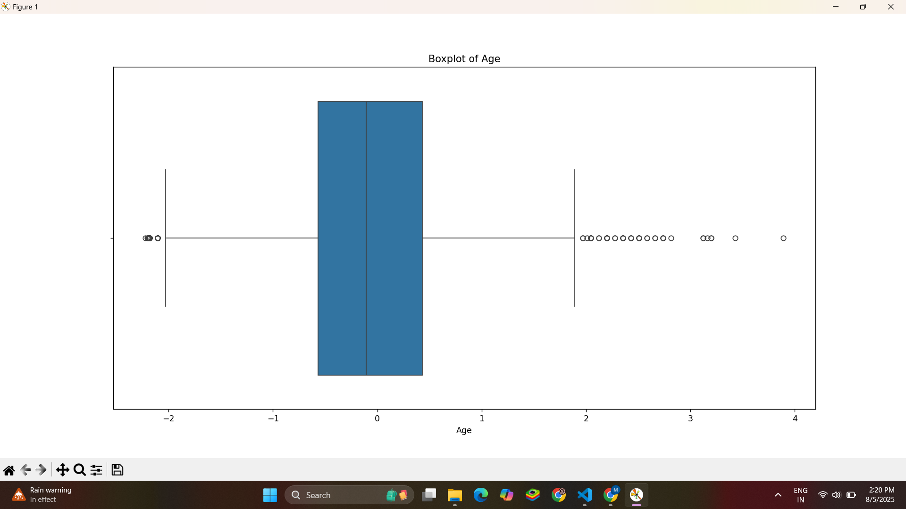

Task 1: Data Cleaning and Preprocessing – Titanic Dataset

Objective

The goal of this task is to learn how to clean and prepare raw data for use in machine learning models. This includes identifying missing values, handling categorical features, scaling numerical data, and dealing with outliers. The Titanic dataset is used as a base for this exercise.

## Tools Used

* Python
* Pandas
* NumPy
* Matplotlib
* Seaborn
* scikit-learn (StandardScaler)

Dataset

The dataset used is the Titanic dataset, which contains information about passengers such as age, fare, sex, port of embarkation, and survival status.

You can download the dataset from Kaggle:
[https://www.kaggle.com/c/titanic/data](https://www.kaggle.com/c/titanic/data)

 Steps Performed

1. Data Loading and Initial Exploration

The dataset was loaded using `pandas.read_csv()`. Basic inspection was done using:

`.head()` and `.tail()` to view the first and last few rows
`.info()` to check data types and missing values
`.isnull().sum()` to get a count of null entries per column

2. Handling Missing Values

* Age: Filled using the **median**, since it’s more robust to outliers than the mean.
* Embarked: Filled using the **mode**, as it's a categorical feature with very few missing values.
* Cabin: Dropped entirely because it had too many missing values to recover reliably.

 3. Encoding Categorical Variables

 Sex* Converted to numerical format using mapping (`male = 0`, `female = 1`)
Embarked: Converted using one-hot encoding, with the first category dropped to avoid multicollinearity.

 4. Feature Scaling

To standardize numerical features, the `StandardScaler` from scikit-learn was applied to:

* Age
* Fare

Both columns were transformed to have a mean of 0 and a standard deviation of 1.

 5. Visualizing and Handling Outliers

## Boxplots for Outlier Detection

### Boxplot of Fare
The boxplot below shows the distribution of the `Fare` column. Extreme values were removed by filtering out entries where `Fare > 300`.

### Boxplot of Age
The boxplot below shows the distribution of the `Age` column. It helps visualize the central tendency and spread of the data.

These visualizations help justify why certain preprocessing steps (like removing extreme fares) were taken.

Final Output

The cleaned and preprocessed dataset was saved to a new file:

Cleaned_Titanic_Dataset.csv

This version is ready for use in machine learning workflows.

---

